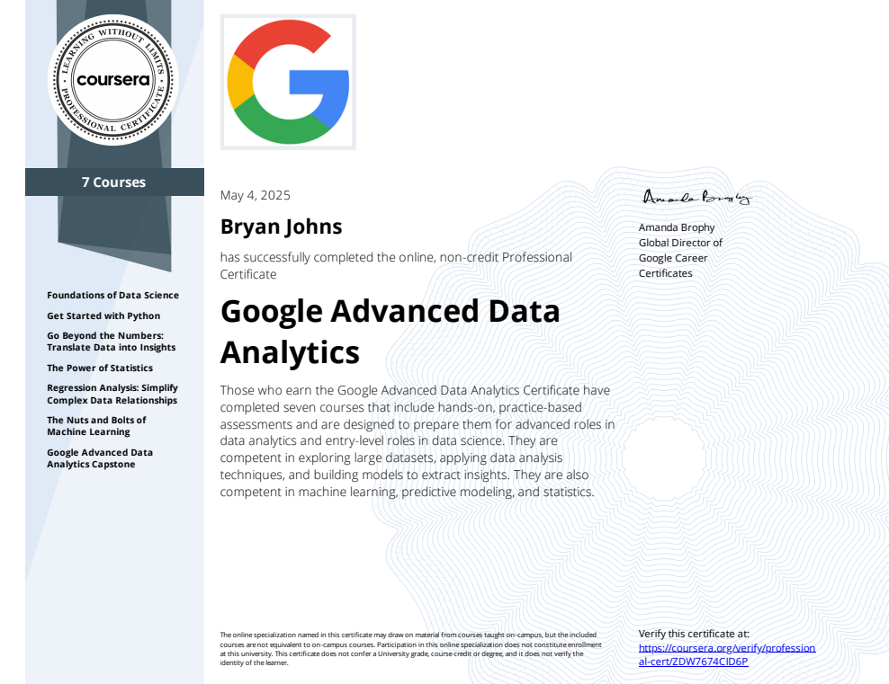

# Salifort Motors Employee Churn - Google Advanced Data Analytics Capstone

*Can machine learning help predict and reduce employee turnover? Real-world HR modeling techniques uncover attrition patterns at a fictional automaker.*

🔗 [Live Report](https://johbry17.github.io/Salifort-Employee-Churn-ml/)

## Table of Contents

- [Project Overview](#project-overview)
- [Features](#features)
- [Tools & Technologies](#tools--technologies)
- [Usage](#usage)
- [Gallery](#gallery)
- [Certificate](#certificate)
- [References](#references)
- [License](#license)
- [Acknowledgements](#acknowledgements)
- [Author](#author)

## Project Overview

**Salifort Motors** is a fictional car company facing high employee turnover. This project models and explains the drivers of attrition using a structured ML workflow:

- Data wrangling & preprocessing
- Exploratory data analysis (EDA)
- Predictive modeling with multiple classifiers
- Model evaluation and interpretability (SHAP, feature importance)
- Final recommendations for HR strategy and retention

Hosted online as an interactive web report aimed at both technical and general audiences.

## Features

- 📊 Interactive visual EDA (Seaborn, Matplotlib)
- 🤖 Four predictive models: Logistic Regression, Decision Tree, Random Forest, XGBoost
- 🔍 Model evaluation: confusion matrices, recall scores, misclassification analysis
- 🧠 SHAP and feature importances for explainability
- 💬 Executive summary with actionable business takeaways

## Tools & Technologies

- **Language:** Python
- **Libraries:** pandas, seaborn, matplotlib, scikit-learn, xgboost, statsmodels, shap
- **Environment:** Jupyter Notebook
- **Deployment:** GitHub Pages (HTML report)

## Usage

All analysis can be found online at [project site](https://johbry17.github.io/Salifort-Employee-Churn-ml/).

1. Clone the repository.
2. Install required dependencies from `requirements.txt`.
3. Open the notebooks in the `notebooks/` directory to explore the analysis:
    - `eda.ipynb` for exploratory data analysis
    - `models.ipynb` for model development and evaluation
    - `executive_summary.ipynb` for a project overview and key findings

## Gallery

EDA Insights:

Model Results:

## Certificate

Final capstone project for [Google Advanced Data Analytics Professional Certificate](https://www.coursera.org/professional-certificates/google-advanced-data-analytics):

## References

- [Google Advanced Data Analytics Capstone](https://www.coursera.org/professional-certificates/google-advanced-data-analytics)
- [Kaggle HR Analytics Dataset](https://www.kaggle.com/datasets/mfaisalqureshi/hr-analytics-and-job-prediction) (inspiration)

## License

MIT License © 2025 Bryan Johns. See [LICENSE](LICENSE) for details.

## Acknowledgements

- Thanks to Google and Coursera for the capstone structure.
- Style inspiration for header from [Start Bootstrap Clean Blog](https://startbootstrap.com/theme/clean-blog)

## Author

Bryan Johns, June 2025  
[bryan.johns.official@gmail.com](mailto:bryan.johns.official@gmail.com) | [LinkedIn](https://www.linkedin.com/in/b-johns/) | [GitHub](https://github.com/johbry17) | [Portfolio](https://johbry17.github.io/portfolio/index.html)
