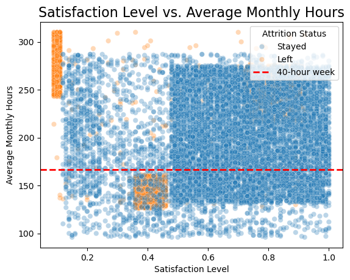

# Salifort Motors Employee Churn - Google Advanced Data Analytics Capstone

A machine learning data analytics capstone project exploring employee attrition and workforce trends at the fictional auto company, Salifort Motors.

Project results are hosted online as a web document [here](https://johbry17.github.io/Salifort-Employee-Churn-ml/).

- [Description](#description)
- [Features](#features)
- [Usage](#usage)
- [Gallery](#gallery)
- [References](#references)
- [License](#license)
- [Acknowledgements](#acknowledgements)
- [Author](#author)

## Description

This project investigates the drivers of employee attrition at Salifort Motors using a real-world-inspired HR dataset, and includes statistical modeling and machine learning to support strategic HR decision-making. The workflow includes:
- Data cleaning and preprocessing
- Exploratory data analysis (EDA)
- Predictive modeling (Logistic Regression, Decision Tree, Random Forest, XGBoost)
- Model evaluation and interpretation
- Results communicated online, for both technical and general audiences
- Business recommendations for employee retention

All analysis is performed in Python using Jupyter Notebooks.

## Features

- Interactive and visually-rich exploratory data analysis
- Multiple machine learning models for attrition prediction
- SHAP and feature importance visualizations for model interpretability
- Clean, web-friendly presentation of results for technical and non-technical audiences
- Actionable business recommendations

## Usage

All analysis can be found online at [project site](https://johbry17.github.io/Salifort-Employee-Churn-ml/).

1. Clone the repository.
2. Install required dependencies from `requirements.txt`.
3. Open the notebooks in the `notebooks/` directory to explore the analysis:
    - `eda.ipynb` for exploratory data analysis
    - `models.ipynb` for model development and evaluation
    - `executive_summary.ipynb` for a project overview and key findings

---

## Gallery

Sample visualizations and results:

## References

- [Google Advanced Data Analytics Capstone](https://www.coursera.org/professional-certificates/google-advanced-data-analytics)
- [Kaggle HR Analytics Dataset](https://www.kaggle.com/datasets/mfaisalqureshi/hr-analytics-and-job-prediction) (inspiration)

## License

This project is licensed under the MIT License. See [LICENSE](LICENSE) for details.

## Acknowledgements

Many thanks for header and style inspiration to Start Bootstrap's Clean Blog v6.0.9 (https://startbootstrap.com/theme/clean-blog). Copyright 2013-2023 Start Bootstrap. Licensed under MIT (https://github.com/StartBootstrap/startbootstrap-clean-blog/blob/master/LICENSE)

Many thanks also to Google and Coursera for the capstone framework and the opportunity to learn.

## Author

Bryan Johns
June 2025